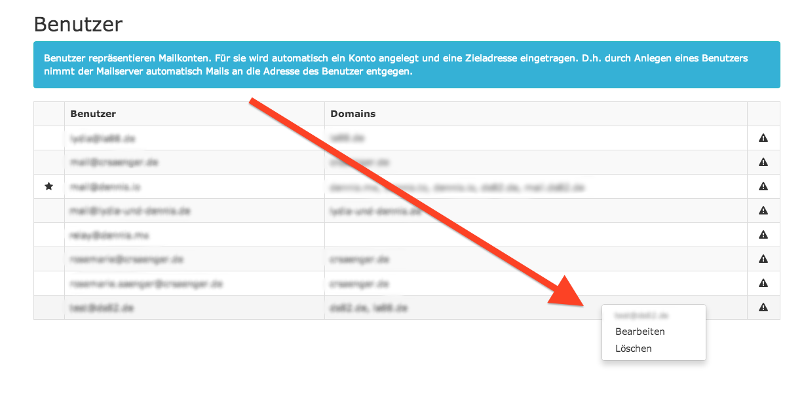

# angular-contextmenu

[](https://nodei.co/npm/angular-contextmenu/)

[](http://travis-ci.org/ds82/angular-contextmenu) []() [](https://greenkeeper.io/)

[demo]: http://ds82.github.io/angular-contextmenu/
[jsbin]: http://jsbin.com/hodul/13/edit?html,js,output
[jquery]: http://jquery.com
[bootstrap]: http://getbootstrap.com
[angular]: http://angularjs.org
[download]: https://github.com/ds82/angular-contextmenu/releases

> An [angular] module that utilizes [bootstrap]'s dropdown as contextmenu

With this simple angular module you can use bootstrap dropdown menus as
contextmenus on various elements (e.g. tables).

Try the **[DEMO][demo]** or have a look at [jsbin].



## Why?

Yes, there are already a few angular modules which add contextmenus similar to this. *But* competition isn't a bad thing right?

## Todos

* remove jquery & bootstrap dependency
* add more tests
* add travis integration
* document code

## How to use

Install via npm..
```
npm install angular-contextmenu
```

Install via bower..
```
bower install angular-contextmenu
```

or [download] from github.

 * get the contextmenu.(js|css) files from dist/
 * make them available on your page
 * make angular load the module:
```js
var app = angular.module('app', [
  'ngResource',
  'ngRoute',
  'io.dennis.contextmenu'
]);
```
 * define the contextmenu in your template
```html
<!-- contextmenu -->
<div contextmenu="meta.contextmenu" class="dropdown contextmenu">
  <ul class="dropdown-menu" role="menu">
    <li class="dropdown-header">
      {{ meta.contextmenu.item.email }}
    </li>
    <li>
      <a role="menuitem" tabindex="-1" href
         ng-href="#/user/{{ meta.contextmenu.item.email }}/edit"
      >
        <span>Edit</span>
      </a>
    </li>
    <li>
      <a role="menuitem" href
        ng-click="delete(meta.contextmenu.item)"
      >
        <span>Delete</span>
      </a>
    </li>
  </ul>
</div>
```
 * link it to your html element
```html
<table class="table" contextmenu-container="meta.contextmenu">
  <tr>
    <th>&nbsp;</th>
    <th>User</th>
    <th>Domains</th>
    <th>&nbsp;</th>
  </tr>
  <tr ng-repeat="row in data" contextmenu-item="row">
    <td class="col-center">
      <span class="fa fa-star" ng-show="row.is_admin" />
    </td>
    <td>{{row.email}}</td>
    <td>{{row.domains.join(', ')}}</td>
    <td class="col-center">
      <span class="fa fa-warning" ng-show="!user.maildirCheck.isMaildir" />
    </td>
  </tr>
</table>
```

## example

You can find an example with angular v1.2 and angular v1.3 in the example folder.

## dev

You can use npm to build/bundle the module:

```
npm install
npm run build
```

If you want a watcher and auto-rebuild you can use nodemon for this:

```
npm install -g nodaemon
nodemon --ignore dist --exec "npm run build"
```

